# Code Walkthrough
{: .no_toc }

1. TOC
{:toc}


## Library Setup
To use the Arduino Debugger library, you must:
1. Download the code's zipped folder: link here
2. Install the zipped library via the Arduino IDE
3. Include the library at the top of your program
```cpp
#include <Debugger.h>
```

4. Create an Arduino debugger object: 

<div style="padding-left:25px" markdown="1">

    
```cpp
//initialize method signature
static ArduinoDebugger initialize(bool usingFloat, bool isAvr, bool usingTerminal);

//Example configuration for Ardunio Uno
ArduinoDebugger debugger = Debugger::initialize(false, true, false);
```  

The debugger is created via the initialize method.  The initialize method requires 3 booleans in order to properly configure the debugger for your setup.  The booleans (in order) set the following options:
<div style="padding-left:25px">
<span style="font-weight:bold;">bool usingFloats</span>
    <dl style="padding-left:25px">
      <dt>true&nbsp;</dt>
      <dd>allow for float variables to be added to the variable watch.  This can use a large chunk of memory and should be set to false if you are using smaller memory boards (UNO) & especially if you are not using floats within your program.</dd>
      <dt>false</dt> 
      <dd>cannot handle floats (recommended setting to conserver program space)</dd>
    </dl>
    <span style="font-weight:bold">bool isAvr</span>
    <dl style="padding-left:25px">
      <dt>true&nbsp;</dt>
      <dd>the board being compiled for is an AVR based microchip.  Some examples would be the Arduino Uno, Arduino Mega, or the Adafruit Circuit Playground Classic.</dd>
      <dt>false</dt>
      <dd>the board being compiled for is NOT an AVR based microchip but is instead an ARM based microchip. Some examples would be the Arduino Due, the Micro:Bit, or the Adafruit Circuit Playground Express.</dd>
    </dl>
    <span style="font-weight:bold">bool usingTerminal</span>
    <dl style="padding-left:25px">
      <dt>true&nbsp;</dt>
      <dd>Serial output will be optimized for terminals that allow for the screen to be cleared.</dd>
      <dt>false</dt>
      <dd>Serial output will be configured for the standard Arduino Serial Monitor which does not allow for the screen to be cleared.</dd>
    </dl>
</div>
</div>    
After you have included the library and created your debugger, you'll be set to add your variables to the watch list.

## Adding Variables to the Watch List
The Arduino Debugger is able to display the current value of your program's variables AND update their values, while the Arduino program is still running. But in order for the debugger to do that, you must first tell it which variables you are instead in "watching". To do this, you will need to call the add() method:
```cpp
  //add method signature
  void add(void* var_ptr, Type type, char var_name[]);
  
  //example call to the add method
  debugger.add(&var, TYPE, "var");
```
The add method requires three parameters:
<div style="padding-left:25px">
    <dl>
      <dt style="text-align:center">
          <span style="font-weight:bold;">void* var_ptr</span><br>Memory Address 
        </dt>
      <dd>The debugger needs to know where the variable is in memory. To do this in C, we apply an apersand, &, to the front of a variables name.  For example if you want the memory address of the variable number, <span markdown="1">`byte number = 0;`</span>, you would write <span markdown="1">`&number`</span>
      </dd>
      <dt style="text-align:center">
          <span style="font-weight:bold">Type type</span><br>Data Type
        </dt>
      <dd>The debugger needs to know what type of data the variable is holding.  TYPE refers to an enum which has the following options to cover Arduino's data primitives & arrays:
          <p>BYTE, BYTE_ARRAY, INT, INT_ARRAY, LONG, LONG_ARRAY, FLOAT, FLOAT_ARRAY, CHAR, CHAR_ARRAY, BOOL, BOOL_ARRAY</p> 
          <p class="text-red-000">Be aware that FLOAT can only be used if the debugger was initailized with usingFloats set to true.</p>
          <p><a name="arrays"></a>The TYPE enum also provides options to handle arrays, but they require a bit more work.  In order to use an array, the debugger must know how many elements are in the array. To provide that information, you'll need to append the _ArraySize to the end of the variable name.  For example: <span markdown="1">`byte numbers[] = {1,2,3};`</span> would be listed as <span markdown="1">"numbers_3"</span></p>
        <p>Notice that <span class="text-red-000">Strings are not listed as a valid TYPE</span>.  To conserve space, the Arduino Debugger only works with character arrays.  In order to pass in a String, you'll need to call the c_str() method instead of using the apersand, &var.  For example:
<div markdown="1"> 
```cpp
String message = "Hello world";
debugger.add(message.c_str(), CHAR_ARRAY, "message_11");
```
</div>
              </p>
        </dd>
      <dt style="text-align:center">
          <span style="font-weight:bold">char var_name[]</span><br>Variable Name
      </dt>
      <dd>The last parameter is char array that lists the name of the variable.  This will be used to identify the variable when the debugger displays its information to the Serial Monitor.  This parameter is restricted to a maximum of 14 characters.  So if your variable name is too big, you can instead use an abbreviation.<br>
   </dd>
    </dl>
    <p>In order to conserve space, the Arduino Debugger's watch list is limited to a <span class="text-red-000">maximum of 10 variables</span>.  Experienced programs can increase/decrease this variable limit by updating <span markdown="1">`Variable var_watch[10];`</span>, located in the ArduinoDebuger.h file.</p>
</div>

## Adding a Breakpoint
In order to debug your program, you'll need to add in a breakpoint.  The breakpoint will pause your Arduino program and allow you to check on the current state of your variables & hardware pins.  To do this you'll need to add a call to the breakpoint method:
```cpp
  //breakpoint method signature
  void breakpoint(char name[]);
  
  //example call to the breakpoint method
  debugger.breakpoint("Identifier");
```
The breakpoint method has an optional parameter, char name[].  The name is used to identify each breakpoint.  So if your program has mutliple breakpoints added, you'll be able to tell which one you have stopped at.

### Main Menu
Once the Arduino program reaches a breakpoint, you will see the debugger's main menu, via the Arduino Serial Monitor. The menu will allow you to check on the microcontroller's hardware pins (1) or the variables inside the watch list (2).
<figure style="width:70%;margin-left:auto;margin-right:auto;">
  <figcaption style="text-align:center;font-weight:bold;">Debugger's Main Menu</figcaption>
  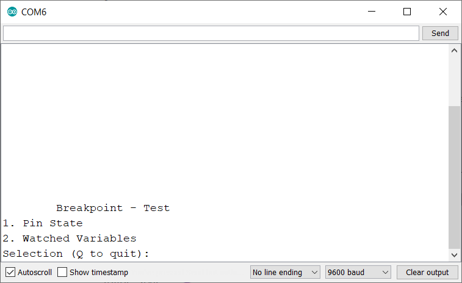
</figure>

#### Hardware Pins
[^1]:The example images displaying hardware pin values were taken using an Adafruit Circuit Playground Classic.
Selecting "Hardware Pins" will display the current state of your boards digital & analog pins. For digital pins, there are three potential states: 
<dl>
    <dt> HIGH</dt>
    <dd>This means the pin is ON and providing <span class="text-red-000">POWER OUT</span></dd>
    <dt>LOW</dt>
    <dd>This means the pin is OFF</dd>
    <dt>HIGH(Power In)</dt>
    <dd>This means the pin is receiving <span class="text-red-000">POWER IN</span> from an external power source</dd>
</dl>

<figure style="width:70%;margin-left:auto;margin-right:auto;margin-bottom:10px;">
    <figcaption style="text-align:center;font-weight:bold;">Digital Pins<span markdown="1">[^1]</span></figcaption>
  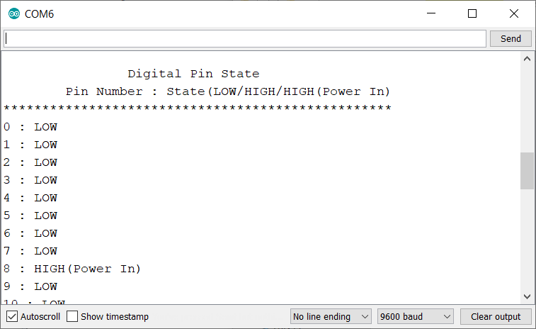
</figure>

The analog pins will be displayed next to their current analogRead() values. The resolution or range for these values is dependent on the microcontroller you are using. For example, the Arduino Uno has a potential value between 0 to 1023 and the Arduino Due has a potential value between of 0 - 4095.

<figure style="width:70%;margin-left:auto;margin-right:auto;">
  <figcaption style="text-align:center;font-weight:bold;">Analog Pins<span markdown="1">[^1]</span></figcaption>
  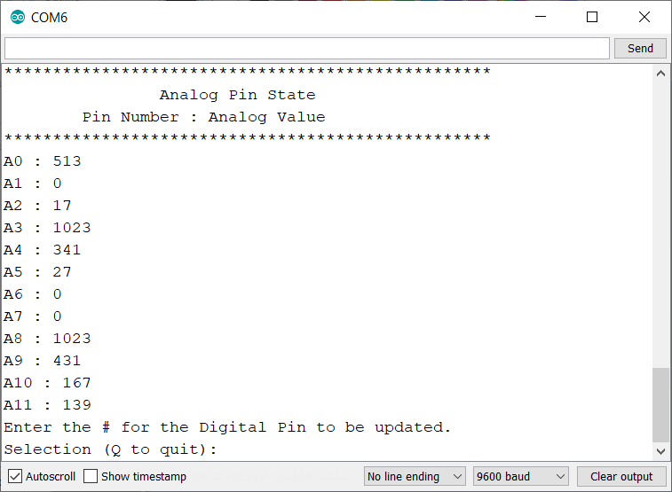
</figure>

##### Setting a Digital Pin's State
Besides viewing the current state, you can update a digital pin to either HIGH or LOW.  Please note, that you can only update a digital pin's value. The library does not support modifying analog output (PWM).   In the example below you can see digital pin 4 being updated from LOW to HIGH.
<figure style="width:70%;margin-left:auto;margin-right:auto;">
    <figcaption style="text-align:center;font-weight:bold;">Update Pin 4 to High<span markdown="1">[^1]</span></figcaption>
  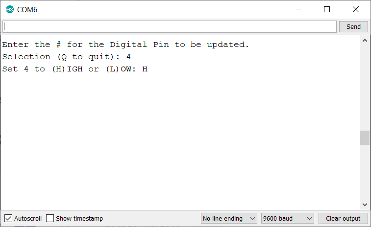
</figure>

<figure style="width:70%;margin-left:auto;margin-right:auto;margin-top:10px;">
  <figcaption style="text-align:center;font-weight:bold;">Pin 4 Updated<span markdown="1">[^1]</span></figcaption>
  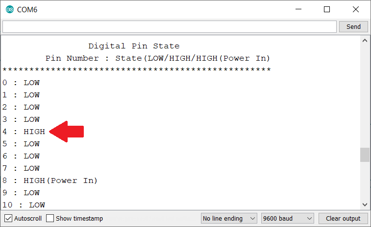
</figure>

#### Variables
Selecting "Variables" will display the current value of each variable currently on the watch list. 

```cpp
long frequency = 253;
char selection = 'A';

debugger.add(&frequency, LONG, "frequency");
debugger.add(&selection, CHAR, "selection");
```
If the above variables had been added to the watch list, then the debugger would display the following:
<figure style="width:70%;margin-left:auto;margin-right:auto;margin-bottom:10px;">
  <figcaption style="text-align:center;font-weight:bold;">Variable Watch List</figcaption>
  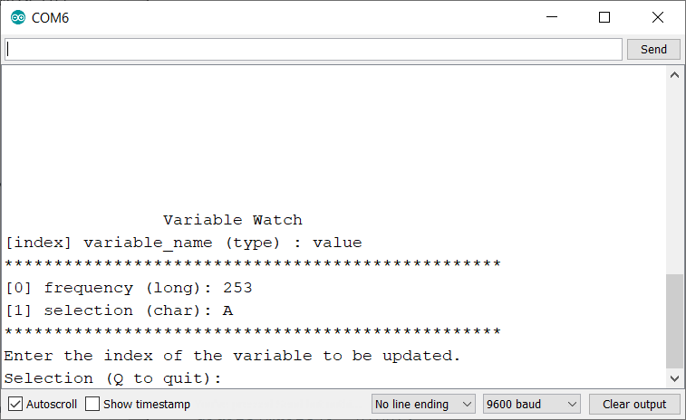
</figure>

You can update the value of any variable listed by entering it's index in the watch list.  For example, to update _frequency_ you would enter _0_
<figure style="width:70%;margin-left:auto;margin-right:auto;">
  <figcaption style="text-align:center;font-weight:bold;">Update the Variable Frequency's Value</figcaption>
  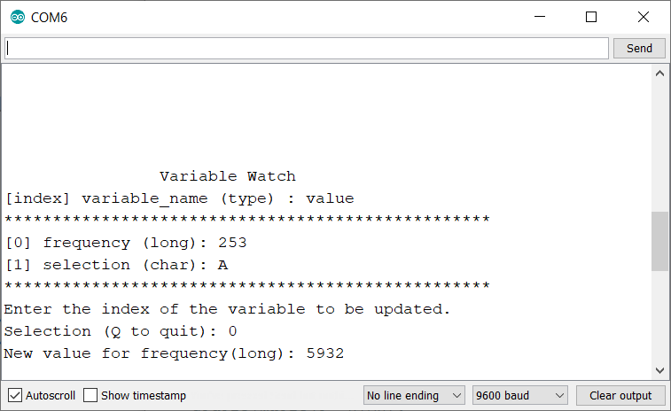
</figure>

<figure style="width:70%;margin-left:auto;margin-right:auto;margin-top:10px;">
  <figcaption style="text-align:center;font-weight:bold;">Frequency's Value Updated</figcaption>
  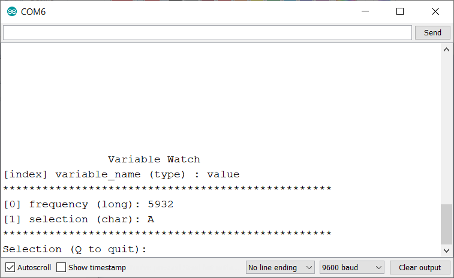
</figure>

<figure style="width:70%;margin-left:auto;margin-right:auto;margin-top:10px;">
  <figcaption style="text-align:center;font-weight:bold;">Invalid Data Entry</figcaption>
  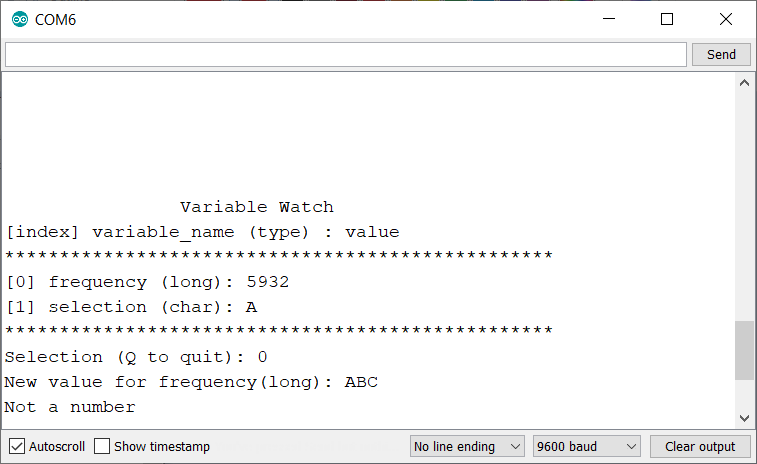
    <figcaption style="text-align:center"><span class="text-red-000">Be aware that the debugger does provide basic validation based on each variable's data type.  This will prevent you from entering invalid values.</span></figcaption>
</figure>

##### Handling Arrays
The debugger does allow for arrays to be displayed and updated.  As noted in the "Adding Variables" [section](#arrays), you will need to format the variable name to denote the array's size (number of elements).  

```cpp
byte pins[] = {0,1,2};
bool valid[] = {false, true};

debugger.add(&pins, BYTE_ARRAY, "pins_3"};
debugger.add(&valid, BOOL_ARRAY, "valid_2"};
```
If the above variables had been added to the watch list, then the debugger will display the following:
<figure style="width:70%;margin-left:auto;margin-right:auto;">
  <figcaption style="text-align:center;font-weight:bold;">Displaying Array Variables in the Watch List</figcaption>
  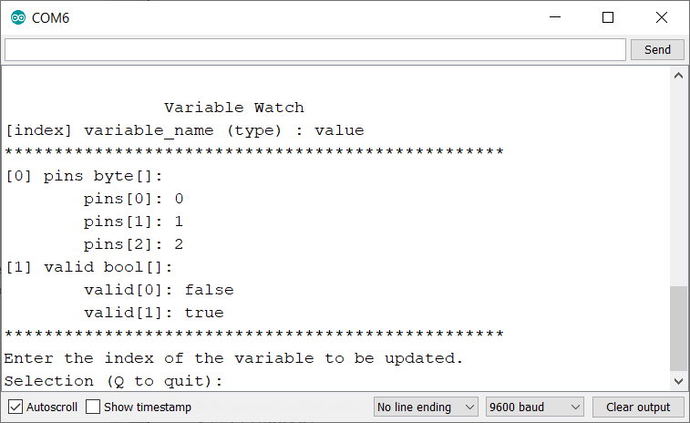
</figure>

The debugger will display each value within the array. To update a specific value inside an array, you must first select the array variable.  For example, to update _valid[1]_ to false you would enter 1 (select the variable) and then enter 1 (to select the array index):
<figure style="width:70%;margin-left:auto;margin-right:auto;">
  <figcaption style="text-align:center;font-weight:bold;">Updating valid[1] to false</figcaption>
  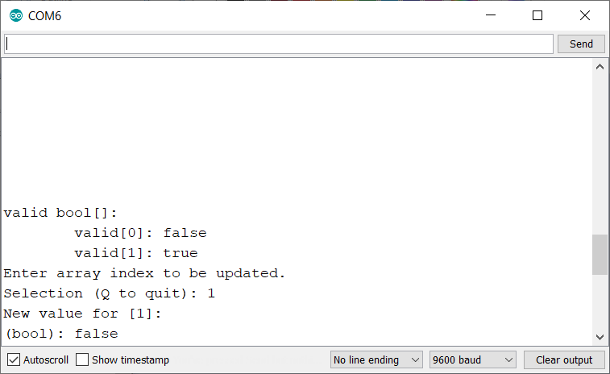
</figure>

<figure style="width:70%;margin-left:auto;margin-right:auto;margin-top:10px;">
  <figcaption style="text-align:center;font-weight:bold;">value[1]'s Value Updated</figcaption>
  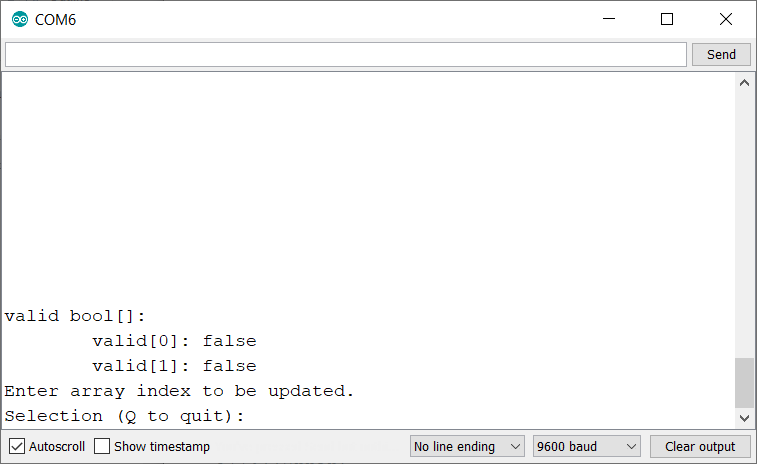
</figure>


## Example Program
Listed below is an example program using the Arduino Debugger. The program is intended to turn on a series of LEDS connected to an Arduino device, but there is an error located within the for loop that prevents all of the LEDs from turning on.  By placing breakpoints within the FOR loop, one can see that the variable _i_ is being incorrectly updated and also see that _pins[1]_ & _pins[3]_ (Digital Pins 4 & 6) are never set to _HIGH_.  The example code should run on any Arduino Board, but you may have to update the pin numbers listed in the variable _pins_.

```cpp
#include <Debugger.h>
//Standard debugger configuration for Arduino Uno.  If using an ARM processor, set to (false, false, false).
ArduinoDebugger debugger = Debugger::initialize(false, true, false);
void setup() {
  Serial.begin(9600);
  while(!Serial) {}
}
void loop() {
  byte pins[] = {3,4,5,6};//Pins connected to LEDs
  byte i = 0;//for loop counter 
  debugger.add(&i, BYTE, "i");//Add i to variable watch
  debugger.add(&pins, BYTE_ARRAY, "pins_4");//add pins to variable watch, Arrays require unique syntax
  debugger.breakpoint("Before For Loop");
  for(i; i < sizeof(pins)/sizeof(pins[0]); i++){
    debugger.breakpoint("Start For Loop");  
    digitalWrite(i, HIGH);//Turn on the chosen LED
    i++;//Error!
    debugger.breakpoint("End For Loop");
  }
}
```
<figure style="width:70%;margin-left:auto;margin-right:auto;margin-top:10px;">
  <figcaption style="text-align:center;font-weight:bold;">Fritzing Diagram for Example Program</figcaption>
  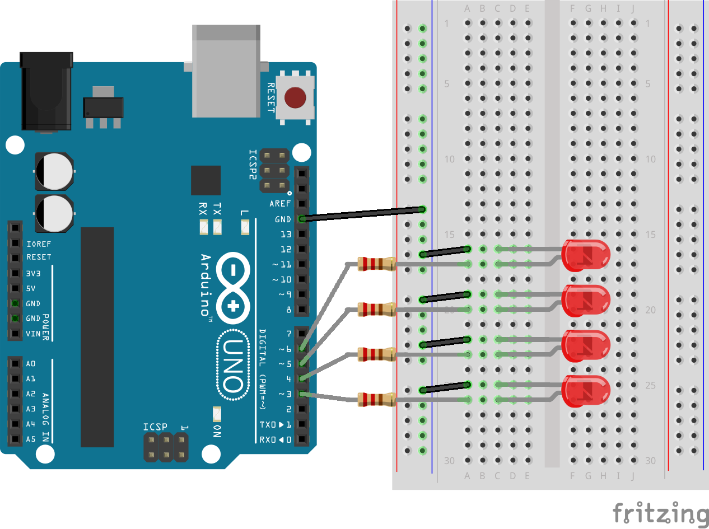
</figure>


